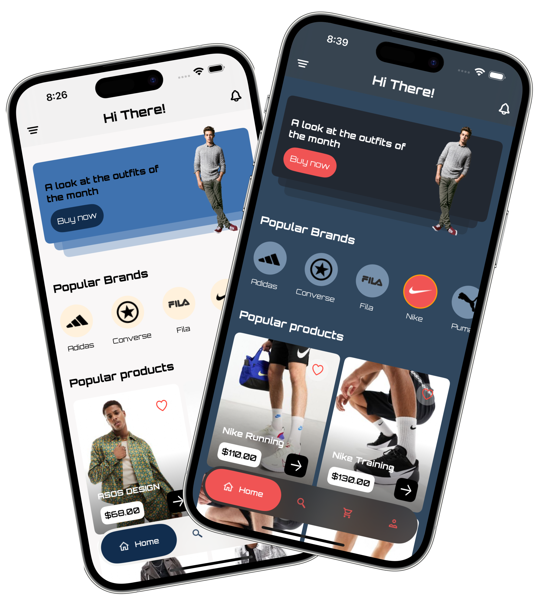

    

# Trendify - Kodeco Capstone Project

    

Trendify is an innovative iOS application crafted using **SwiftUI**, designed to offer a seamless and visually appealing shopping experience for fashion-forward men. Leveraging the robust API from the renowned **ASOS** website, Trendify brings an extensive collection of trendy clothing, shoes, and accessories right to the fingertips of its users. The app aims to bridge the gap between fashion enthusiasts and the latest trends by combining the convenience of mobile shopping with ASOS's diverse range of men's fashion products.

## Video Demo

    

## Environment Variables

To run this project, you will need to create `ASOS-Info.plist` wtih the variables below and add it to `Trendify` folder

| Key             | Value                                                      | 
| ----------------- | -----------------------------------------------------------------| 
| `X-RapidAPI-Key`    | API Key generated from rapidapi.com | 
| `X-RapidAPI-Host`    | `asos2.p.rapidapi.com` | 

## Color Reference

| Color             | Light Mode                                                       | Dark Mode                     |
| ----------------- | -----------------------------------------------------------------| ----------------------------- |
| Background Color     |  #F9F7F7 |  #30475E |
| Accent Color     |  #112D4E |  #F05454 |
| Light Accent Color     |  #3F72AF |  #222831 |
| Lightest Accent Color     |  #FFF1DC |  #7690AB |

## Features

- **XCode 15 & iOS17**
- **MVVM**
    - Implemented MVVM architecture with API work done in a Service
- **Dark/Light Mode**
    - Saved to UserDefaults
- **Portrait/Landscape Modes**
    - Modified views based on SizeClass to make app look good in both orientations
- **Custom App Icon**
- **Custom Display Name**
- **Swift Modern Concurrency** - async/await, URLSession
- **Error Handling**
    - Throwing custom errors during API call and displaying them in UI
- **Animations**
- **Animated Splash Screen**
- **Onboarding Screen**
    - Consists of 3 screens created with TabView
    - Only appears when app is launched for the first time
- **TabView** - Home, Search, Cart, Profile
    - Custom animated TabView with 4 tabs
- **List of Products** - ScrollView, Grids, For loops
    - Used V/HGrids, V/HLists and Foreach loops to display data
- **Sort List by Brands**
    - Brands displayed on Home Screen are hard coded due to the API that does not offer brand icons
    - Clicking on a brand makes an API call to display brand products
    - Clicking one more time deselects the brand and fetches random brands products
- **Product Details** - Images, Price, Sizes, Description
    - User can select quantity and size of the product
    - Minimum quantity is 1 and Max is 99
    - Product can only be added to the cart when size is selected
    - After adding a product user can navigate to cart or continue shopping
    - Note: Product description has HTML tags as it is returned from the API as a String
- **Search Brands**
    - User can search by brand name and tapping on a brand name will show products from that brand
- **Adding Products to Cart**
    - Cart items are saved between app sessions
    - If user adds the same product but with different size, cart will display both products
- **Cart Total Amount** - Subtotal, Tax, Shipping, Promo Code
    - Promo Code is hard coded - `TRENDIFY10`, applies 10% off of Subtotal
- **Favorite Products**
    - User can mark products as Favorites and they will be saved between app sessions
- **Profile Picutre**
    - User can set Profile Picture from gallery and it will be save between app sessions
- **Saving to UserDefaults** - Favorites, Cart Items, Dark/Light Mode, Profile Picture
## API Reference

#### API Endpoints can be found here: https://rapidapi.com/apidojo/api/asos2
Free version allows 500 calls

## Running Tests

#### Project uses XCTest and includes UnitTests and UITests

- To run all the tests press `cmd + U`
- Note: Some tests may fail due to network issues (slow or no internet)
    - In that case, run the failing test once again as a standalone
